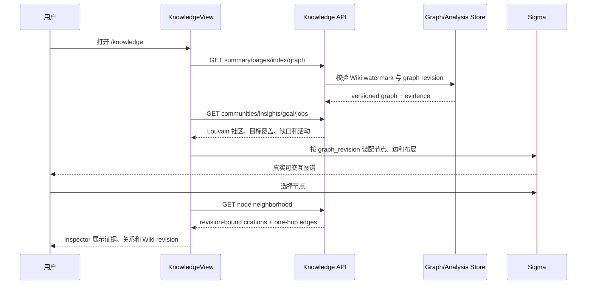

# V7.5.2 知识图谱工作台与前端收口

## 阶段结论

- Source commit：`4ac92f7 feat(knowledge): add graph workspace`
- 开发分支：`dev/sage-v7`
- 收口结论：**可合并，V7.5.2 已完成并推送远端开发分支**。
- 本阶段只实现 Knowledge Surface，不修改 Chat Harness。同期 Harness 提交为 `e2484ed`、`3f68262`，通过文件边界和精确暂存保持并行开发互不覆盖。

V7.5.2 将旧的纵向 Knowledge 调试页替换为可实际使用的知识工作台。首页不再重复提供 RAG 问答，而是聚焦来源同步、版本化 Wiki、真实图谱、证据详情、异常处理和目标缺口。

## 组件职责

### `KnowledgeView.vue`

- 装配 Knowledge Graph、Louvain 社区、学习目标、能力覆盖、Wiki、任务、索引和异常 proposal。
- 桌面布局为知识目录、中心工作区、详情 Inspector 三栏。
- `1024px` 以下将目录和 Inspector 转为按需 Drawer，把中心空间让给图谱。
- `680px` 以下图谱退化为可搜索、可选择的节点列表，避免在手机上强行操作密集 Canvas。
- 导入入口只展示后端已经支持的“已授权来源单文件/目录扫描”，没有伪造浏览器直接上传或 Vision 能力。
- 可信本地解析默认自动沉淀；人工审核只用于异常 proposal 和显式回滚。

### `KnowledgeGraphCanvas.vue`

- 使用 `Graphology + ForceAtlas2 + Sigma 3` 渲染本地图谱。
- 图布局按 `graph_revision` 缓存到本地偏好；不同 revision 不复用旧坐标。
- 支持按类型/社区着色、节点类型筛选、文本搜索、缩放、居中和节点选择。
- Sigma 只在桌面图谱真正挂载时动态加载，避免路由测试和移动端触发 WebGL 副作用。
- 标签和边颜色读取 Sage CSS Token，浅色/深色主题均可读。
- WebGL、布局或 renderer 异常会显示真实错误并降级到节点列表，不生成模拟图谱。

### `KnowledgeInspector.vue`

- 无节点选择时展示学习目标与能力覆盖。
- 选择节点后展示社区、Wiki revision、本地洞察、证据 citation 和一跳关系。
- 平板/手机使用模态 Drawer，支持 Escape、Tab 焦点圈定和焦点返回。

## 数据与交互序列

## 测试证据

- 前端全量：`36 files / 298 passed`。
- Knowledge 组件与页面定向：`14 passed`。
- 后端 Graph、Graph Analysis、Goal、Knowledge API：`17 passed`。
- `vue-tsc -b` 与 Vite 生产构建通过。
- `git diff --check` 通过。
- 桌面 `1440×900`：真实 `135 nodes / 182 edges / 30 communities`，Sigma 7 个 Canvas layer，无横向溢出、无 console error。
- 平板 `1024×768`：目录和 Inspector 收起，图谱宽度从 478px 修正为 796px；选择 Wiki 后详情以 Drawer 打开。
- 手机 `390×844`：节点列表降级，无横向溢出；节点选择后详情占满 `390×844`，中文标题不遮挡。

## 与参考稿的对齐和差异

已对齐：左侧知识组织、中间图谱、右侧详情、底部状态、真实筛选和多颜色节点语义。

保留差异：

- 参考稿使用顶部产品导航；当前 Sage 继续复用 Personal Companion 左侧全局导航，避免与 Chat Harness 并行修改 Router/App。
- 参考稿的社区分组是策展式概念图；当前图谱严格投影真实 Wiki/WIKILINK/来源证据，因此布局反映真实连接密度，不伪造五个对称模块。
- 参考稿底部展示多条模拟处理队列；当前只显示真实运行任务、Wiki、图谱和社区状态。

## 已关闭风险

- 修复深色主题下 Sigma 默认黑色标签不可读。
- 修复 `1024px` 仍保留空 Inspector grid track，导致中心图谱只有 478px。
- 修复 Sigma 静态 import 在 `jsdom` 路由测试中读取 WebGL 的副作用。
- 增加 renderer 异步失败降级，避免未处理 Promise。
- 知识详情请求以 request id 隔离，迟到响应不会覆盖后选择的节点。
- 所有图谱边继续携带 citation、chunk、page revision 和 source revision，不把推断关系展示成无来源事实。

## 遗留问题

- 当前真实 Wiki 的结构主要由阅读地图形成中心密集簇，图谱视觉不如策展式演示稿均衡；后续应优化社区折叠、语义实体抽取和图布局，而不是伪造坐标。
- 浏览器直接文件上传、图片/扫描 PDF Vision、MinerU 和飞书来源尚未接线。
- Wiki 页面目前只展示元数据和 revision，正文阅读/编辑 Dock 尚未完成。
- 大于千节点时需要社区层级加载、Web Worker 布局和视口裁剪。
- 当前能力覆盖是关键词证据覆盖，不等于用户已经掌握该能力。

## 下一阶段边界

### V7.5.3 Knowledge Surface

- Wiki 正文与 citation Dock。
- 社区折叠、社区级详情和布局版本迁移。
- 增量来源发现、变更预览、同步计划和失败恢复。
- 浏览器上传契约与多模态解析任务设计，但不提前伪造后端能力。

### Harness 并行线

Chat Harness 2.0 继续由独立会话负责主对话、工具过程和个人助手循环。本阶段不把 Knowledge Inspector 直接嵌入 Coding/Chat，共享 Dock 接线必须等两边稳定提交后再做单独小版本。

### 部署边界

V7.5 的本地图谱完成后再进入服务器部署更合适：先用 Docker Compose 验证单机持久卷、Git Wiki、SQLite evidence、任务恢复和备份；稳定后再接 GitHub Actions 一键部署。首发不依赖 Kubernetes。
