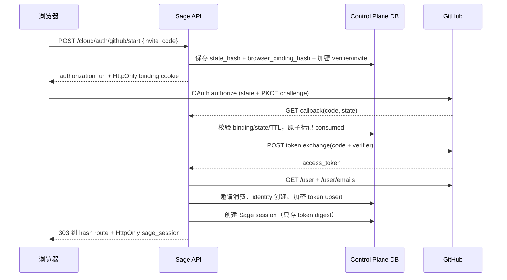

# V7.0 GitHub OAuth 与云控制面复盘

> source commits: `f261787`, `61a6c6a`（`codex/feat-v7-control-plane`）
> 日期：2026-07-13

## 本次交付

V7 在独立 worktree 中开始，本阶段先完成“云端身份入口”的安全边界。当前仍是本地开发能力，不要求先购买服务器；服务器、域名和 SSH 放到 V7.2 部署阶段。

已完成：

- GitHub OAuth start/callback 路由，邀请码只通过 POST body 进入，不放进授权 URL。
- HMAC 签名的随机 state、PKCE S256、五分钟有效期、数据库原子单次消费。
- HttpOnly、SameSite=Lax 的浏览器绑定 Cookie；state 被窃取到另一浏览器也不能完成回调。
- GitHub profile 使用不可变 numeric `id` 作为 provider subject；邮箱只接受 GitHub 返回的 verified email，优先 primary。
- GitHub access token 使用独立密钥 AES-GCM 加密后落库，原文不进入浏览器、JSON、日志或 Sage session。
- OAuth 成功后重新签发 Sage session；GitHub token 不作为 Sage session 使用。
- 生产配置缺少应用密钥、GitHub 密钥、HTTPS 前端地址、HTTPS callback 或误开开发登录时 fail-closed。
- 修复邀请消费的 PostgreSQL 外键顺序：先 flush user，再条件消费 invite，失败整体 rollback。

## 事件流程

## 组件职责

| 组件 | 职责 |
| --- | --- |
| `core/cloud/security.py` | AES-GCM 密文、state HMAC 签名，不负责 HTTP |
| `core/cloud/github/oauth.py` | PKCE、GitHub API、verified email、身份绑定编排 |
| `core/cloud/auth/repository.py` | OAuth transaction、credential、invite 和 session 的事务持久化 |
| `api/cloud_auth.py` | 路由、Cookie 属性、固定错误和前端重定向 |
| `core/config/settings.py` | 环境配置与生产 fail-closed 检查 |
| `db/models.py` | OAuth transaction、provider credential、cloud user 记录 |

## 验证证据

- 后端全量：`956 passed`。
- V7 OAuth/认证/工作区/配置/数据库定向：`31 passed`。
- `ruff check .`：通过。
- `mypy core/ mcp_servers/ agents/ api/ db/`：123 个源文件无错误。
- `git diff --check`：通过。
- OAuth 测试覆盖 PKCE challenge、浏览器绑定、state replay、token 密文落库、开放重定向拒绝和无配置 503。

## 仍未完成

本提交不是完整 GitHub 云工作区：

- 尚未实现 GitHub App 安装授权、repository node ID 列表和按仓库短期 installation token。
- 尚未 clone 到用户隔离目录，也没有 WorkspaceProvider、只读 `HEAD/status/read/diff` 证据卷。
- 尚未实现 sandbox、任务队列、配额、终端和运行器。
- 尚未加入 Origin/CSRF 写请求策略、正式生产迁移工具、Docker Compose 和 GitHub Actions。
- OAuth provider token 暂无用户主动撤销/轮换接口。

## 下一阶段边界

### V7.1：GitHub 仓库授权与隔离工作区

1. 注册 GitHub App，浏览器完成安装选择；服务端只保存 installation ID 和加密短期 token。
2. 通过 repository node ID 建立用户授权记录，禁止前端直接传 clone URL 作为权限依据。
3. `WorkspaceProvider` 创建用户/项目/仓库三层隔离目录；clone、HEAD、status、read 和 bounded diff 都写审计证据。
4. 相同仓库被不同用户选择时，使用独立工作区和独立 SQLite evidence volume。

### V7.2：服务器私测

先用 Docker Compose + GitHub Actions 部署到阿里云 ECS/VPS，加入反向代理、HTTPS、健康检查、结构化日志、备份和回滚。Kubernetes 等 Docker 私测稳定后再学，不作为首发依赖。

### V8：本地 Companion 与公开 HR Agent

本地 Companion 负责未提交代码和本地工作区；HR 窗口只读取发布后的公开资料包，使用独立 RAG/agentic 检索，不能访问私有 session、Memory、Git、工作区、密钥和内部 RAG。

## 收口结论

- 本短期分支：**可合并**（测试、质量检查、构建前的后端门禁均通过）。
- 当前 worktree：提交后应保持干净。
- 暂不删除 V6.9 worktree 或分支；它仍由另一个会话负责前端收线。
- V7 下一步应继续在 `codex/feat-v7-control-plane` 上实现 GitHub App/隔离工作区，完成后再合入 V7 集成分支。
