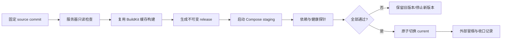
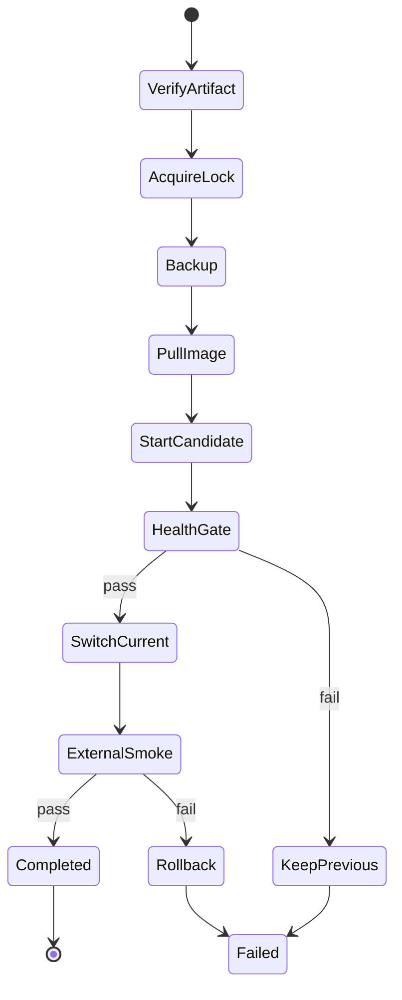

# V7 部署流程与 GitHub Actions CI/CD 学习路线

> 日期：2026-07-15
> 当前基线：受限 staging `33e3951`
> 关联复盘：[[48-V7受限Staging服务器部署收口]]
> 状态：本文是学习路线和实施蓝图，不代表 GitHub Actions 已经实现。

## 1. 先理解这次部署做了什么

这次部署不是简单执行一条 `docker compose up -d`，而是一条带证据和回滚边界的发布链路：



这条链路就是后续 CI/CD 的原型。GitHub Actions 不会改变发布原则，只是把可以自动化的步骤放进可审计的流水线。

## 2. 本次手工部署的真实步骤

### 2.1 固定发布对象

- 部署对象固定为 Git 对象 `33e3951f1785d90462be5c87dacbfc2b1b43a49d`。
- 活动 `dev/sage-v7` 已前进到 `fdd7411`，不能把“当前分支”误当成“指定 release”。
- 发布目录使用 `/opt/sage/releases/33e3951`，`REVISION` 保存完整 commit SHA。

学习点：部署输入必须是 commit SHA、tag 或 image digest，不能依赖模糊的 `latest`。

### 2.2 先做服务器只读盘点

在任何写操作前检查：

- 是否已有 Docker build、pip、BuildKit 或 Compose 进程；
- 已有镜像、BuildKit 缓存和磁盘余量；
- Docker、fail2ban、UFW、监听端口和容器状态；
- release 目录、`current` 指针和回滚快照；
- 是否已经存在同名 Compose 项目。

学习点：部署脚本必须幂等。发现已有构建时应接管监控，不能重复启动第二个构建。

### 2.3 从缓存恢复镜像构建

上一轮 SSH/cc-connect 超时取消了 BuildKit，但服务器保留了约 `4.8 GB` 构建缓存。恢复时重跑同一构建：

```bash
docker compose -f compose.yml build api
```

前端 `npm ci/build`、apt、基础镜像和 requirements 复制层全部命中缓存。未完成的 pip `RUN` 层不能复用下载进度，只能重新执行。

为了避免 SSH 再次断开连带取消构建，实际使用临时 systemd unit 托管：

```bash
systemd-run \
  --unit=sage-api-build-33e3951 \
  --collect \
  --property=WorkingDirectory=/opt/sage/releases/33e3951 \
  --property=TimeoutStartSec=infinity \
  /usr/bin/docker compose -f compose.yml build api
```

通过以下命令观察，而不是启动重复任务：

```bash
systemctl show sage-api-build-33e3951
journalctl -u sage-api-build-33e3951 -n 100 --no-pager
docker buildx du
docker system df
df -h /
```

学习点：长任务的生命周期应属于服务器或 CI runner，不应属于临时 SSH 连接。

### 2.4 启动受限 staging

镜像成功后再启动 Compose，并让 Compose 等待健康检查：

```bash
docker compose -f compose.yml up -d --wait --wait-timeout 300
```

本次同样由临时 systemd unit 托管，避免启动过程被会话中断。启动顺序由 `depends_on.condition: service_healthy` 保证：

```text
PostgreSQL / Redis / Qdrant
  -> API
  -> Gateway
```

### 2.5 验证不是只看“容器 Up”

本次执行了以下探针：

| 层级           | 探针              | 通过标准                         |
| ------------ | --------------- | ---------------------------- |
| PostgreSQL   | `pg_isready`    | accepting connections        |
| Redis        | 认证后 `PING`      | `PONG`                       |
| Qdrant       | 容器内 `6333` TCP  | 建连成功                         |
| API          | `/health`       | HTTP 200                     |
| API contract | `/openapi.json` | HTTP 200，55 个 paths          |
| Gateway      | `/health`       | HTTP 200                     |
| 安全门          | `/`             | 按设计 HTTP 503                 |
| 暴露面          | 宿主监听端口          | 仅 Gateway 80；数据服务不映射         |
| 稳定性          | 容器状态            | 全部 healthy，restart count 为 0 |
|              |                 |                              |

学习点：`docker ps` 的 `Up` 只说明进程存在，不能证明数据库可用、API 合约可读或入口安全。

### 2.6 健康通过后切换 current

全部探针通过后，才原子切换：

```bash
ln -s /opt/sage/releases/33e3951 /opt/sage/.current.33e3951.$$
mv -Tf /opt/sage/.current.33e3951.$$ /opt/sage/current
```

学习点：`current` 是“当前通过门禁的 release”，不能在构建前或健康检查前提前指向新版本。

## 3. 这次部署暴露出的工程问题

### 3.1 API 镜像过大

`sentence-transformers` 解析到 `torch 2.13.0` 和完整 CUDA 依赖，最终 API 镜像约 `9.1 GB`。服务器根盘达到约 70% 使用率。

在 CI/CD 前必须先完成：

- 拆分 production requirements，不把 pytest、mypy、ruff 等开发依赖装进运行镜像；
- 固定 CPU-only Torch 来源或删除在线服务不需要的本地 embedding 依赖；
- Dockerfile 使用 BuildKit pip cache mount；
- 多阶段构建只复制运行产物；
- 设置镜像体积门禁，超过阈值则拒绝发布。

否则 GitHub Actions 每次构建、推送和服务器拉取都会很慢，CI/CD 只是把慢部署自动化。

### 3.2 生产部署文件还不在仓库

当前仓库没有 `.github/workflows`，生产 Dockerfile、Compose 和 Gateway 配置只存在服务器 release 中。后续必须把可公开的部署逻辑纳入版本控制：

```text
infra/
├── docker/
│   └── sage-api.Dockerfile
├── compose/
│   └── production.yml
├── proxy/
│   └── Caddyfile 或 nginx.conf
└── scripts/
    ├── deploy-release.sh
    ├── health-check.sh
    └── rollback.sh

.github/workflows/
├── ci.yml
└── deploy.yml
```

配置模板可以进仓库，真实 `.env`、模型密钥、OAuth secret、SSH 私钥不能进入仓库。

### 3.3 当前仍是受限 staging

- `DEEPSEEK_API_KEY` 和 OAuth 凭据保持空值；Coding Runtime 尚不可用。
- Gateway 根路径主动返回 503，业务 UI/API 未公开。
- 阿里云安全组未开放公网 80。
- 域名、HTTPS、正式认证入口和公网冒烟尚未完成。

CI/CD 不等于公网发布。先把受限 staging 自动化，再单独通过安全门开放私测。

## 4. GitHub Actions CI/CD 应该如何分层

### 4.1 CI：证明代码可以交付

`ci.yml` 在 Pull Request 和集成分支 push 时执行，不接触服务器，也不读取生产密钥。

建议阶段：

1. 后端单元/集成测试；
2. `ruff check .`；
3. `mypy core/ mcp_servers/ agents/ api/ db/`；
4. 前端测试与 production build；
5. `git diff --check`；
6. Docker production build；
7. 镜像漏洞扫描、secret scan 和体积门禁。

CI 失败时不允许进入部署 job。

### 4.2 Artifact：生成不可变制品

通过 CI 后，由 Buildx 构建并推送到 GHCR：

```text
ghcr.io/zeromadlife/sage-api:<full-commit-sha>
ghcr.io/zeromadlife/sage-api@sha256:<image-digest>
```

部署使用 image digest；`staging` 或 `latest` 只能作为方便查看的别名，不能作为服务器的真实发布依据。

Buildx 使用 GitHub Actions cache：

```yaml
cache-from: type=gha
cache-to: type=gha,mode=max
```

这样 CI runner 更换后仍可复用 Docker 层，而不是每次从零下载依赖。

### 4.3 CD：受控部署到 staging

第一版不要 push 到分支就自动上线。使用：

- `workflow_dispatch` 手动触发；
- GitHub Environment：`staging`；
- required reviewer 人工批准；
- `concurrency: sage-staging` 防止两个部署并发；
- 只允许部署已经通过 CI 的 commit SHA/image digest。

CD job 的职责：

1. 通过受限 SSH deploy user 登录；
2. 创建 `/opt/sage/releases/<sha>`；
3. 写入不含密钥的 release manifest；
4. 拉取指定 image digest；
5. 读取服务器已有 `/opt/sage/shared/.env`；
6. 执行数据库备份和 migration；
7. 启动新 release；
8. 执行内部健康与暴露面检查；
9. 通过后原子切换 `current`；
10. 执行外部冒烟；失败则恢复上一 release。

### 4.4 密钥边界

GitHub Actions 只保存部署链路需要的最少凭据：

```text
STAGING_HOST
STAGING_USER
STAGING_SSH_KEY
STAGING_HOST_KEY
```

应用密钥继续放在服务器端 secret/environment：

```text
/opt/sage/shared/.env
```

Actions 不传输、不打印、不生成 `DEEPSEEK_API_KEY`、OAuth secret、session secret 或数据库密码。服务器部署脚本只检查变量是否存在，不输出值。

### 4.5 受限 deploy user

正式 CD 不应长期使用 root。建议创建 `sage-deploy`：

- 只允许访问 `/opt/sage`；
- 只允许执行审核过的 deploy/health/rollback 脚本；
- 不允许任意交互 shell；
- Docker 权限需要单独评估，因为 Docker group 等价于高权限；
- SSH `known_hosts` 必须固定主机指纹，禁止关闭 host key checking。

更严格的方案是让 root-owned systemd service 接收有限参数，由 deploy user 触发固定 unit，而不是直接获得完整 Docker 控制权。

## 5. 建议的 deploy.yml 状态机



关键不变量：

- 同一环境一次只能有一个 deployment；
- 新版本健康前不修改 `current`；
- migration 前必须完成备份；
- 失败时不删除旧镜像、旧 release、volume 或构建缓存；
- 日志只记录 commit、digest、状态和耗时，不记录 secret；
- rollback 必须经过实际演练，不能只存在文档中。

## 6. 数据库 migration 的特殊风险

当前容器 entrypoint 启动时直接调用 `init_db()`。这适合首次 staging，但不够支撑长期 CI/CD。

后续应改为显式 migration job：

```text
backup -> migration precheck -> migrate -> start candidate -> health -> switch
```

数据库变更需要遵守 expand/contract：

1. 先添加向后兼容字段/表；
2. 新旧版本都能运行；
3. 回填数据；
4. 新版本稳定后再删除旧结构。

否则代码可以回滚，数据库却无法回滚，会形成“镜像回滚成功但服务仍不可用”。

## 7. 推荐学习与实施顺序

### 阶段 A：先让镜像适合 CI/CD

- [ ] production requirements 与开发依赖分离；
- [ ] CPU-only Torch 或移除不必要依赖；
- [ ] production Dockerfile 进入仓库；
- [ ] 本地冷构建、热缓存构建和镜像体积有记录；
- [ ] 镜像内以非 root 用户运行。

验收：镜像体积和构建时间达到可接受范围，重复构建明显命中缓存。

### 阶段 B：只做 CI，不部署

- [ ] 创建 `.github/workflows/ci.yml`；
- [ ] PR 自动运行后端、前端、lint、type check 和 production build；
- [ ] 故意制造一个失败，确认 PR 被阻止；
- [ ] 所有 job 不使用生产 secret。

验收：CI 能可靠区分可交付与不可交付 commit。

### 阶段 C：构建并发布 GHCR 镜像

- [ ] 使用 commit SHA tag；
- [ ] 记录 image digest；
- [ ] 启用 Buildx GHA cache；
- [ ] 加入漏洞扫描、secret scan 和体积门禁；
- [ ] 服务器可以只凭 digest 拉取镜像。

验收：同一 commit 得到可追踪、不可变、可复用的制品。

### 阶段 D：手动批准的 staging CD

- [ ] 创建 `deploy.yml`，只允许 `workflow_dispatch`；
- [ ] 配置 `staging` Environment 和 required reviewer；
- [ ] 使用受限 deploy user；
- [ ] 自动执行 backup、pull、migration、health、switch；
- [ ] 失败时保持上一 release。

验收：不登录服务器手工敲命令也能完成一次受审计部署。

### 阶段 E：回滚与故障演练

- [ ] 部署一个健康检查必失败的 candidate；
- [ ] 证明 `current` 没有切换；
- [ ] 部署成功后让外部冒烟失败；
- [ ] 证明可以回到上一 image digest；
- [ ] 执行一次数据库备份恢复演练。

验收：失败路径有真实证据，不只是成功演示。

### 阶段 F：开放邀请制私测

- [ ] 模型与 OAuth 凭据通过服务器 secret 注入；
- [ ] 域名和 HTTPS 完成；
- [ ] 认证入口与 workspace 隔离通过安全测试；
- [ ] 阿里云安全组只放行 22、80、443 的必要范围；
- [ ] 清理确认无依赖的 UFW 历史端口；
- [ ] 外部 health、登录、核心流程和日志告警通过。

验收：从“受限 staging”升级为“可邀请私测”，仍不是无门槛公开服务。

## 8. 第一次 GitHub Actions 实践建议

第一次不要直接写完整 deploy workflow。建议用三个小实验学习：

1. `ci.yml` 只运行 `git diff --check` 和一个定向测试，理解 event、job、step、runner、artifact。
2. 增加 Docker Buildx 但不 push，理解 layer cache 和构建上下文。
3. push 到 GHCR 后，用 `workflow_dispatch` 只执行服务器 `docker pull <digest>`，不启动容器。

三个实验都理解后，再接入健康检查、current 切换和 rollback。这样每一步都有单一变量，失败时容易判断是 GitHub 权限、registry、SSH、Docker、Compose 还是应用本身。

## 9. 下一次实现时的仓库交付物

下一次真正开发 CI/CD 时，至少应交付：

- `infra/docker/sage-api.Dockerfile`；
- `infra/compose/production.yml`；
- `infra/proxy/Caddyfile` 或 `nginx.conf`；
- `infra/scripts/deploy-release.sh`；
- `infra/scripts/health-check.sh`；
- `infra/scripts/rollback.sh`；
- `.github/workflows/ci.yml`；
- `.github/workflows/deploy.yml`；
- 部署脚本单元/静态测试；
- staging 成功部署证据；
- candidate 失败不切换与 rollback 演练证据；
- 新的 Obsidian 收口复盘。

## 10. 当前结论

我们已经跑通 CI/CD 最重要的手工原型：固定版本、缓存构建、受控启动、逐层健康检查、原子切换和回滚边界。后续不是重新研究如何部署，而是把这条已经验证过的路径变成版本化脚本和 GitHub Actions 状态机。

真正开始 CI/CD 前的第一优先级不是 YAML，而是把 `9.1 GB` API 镜像改成适合持续构建和传输的 CPU-only 生产镜像。
