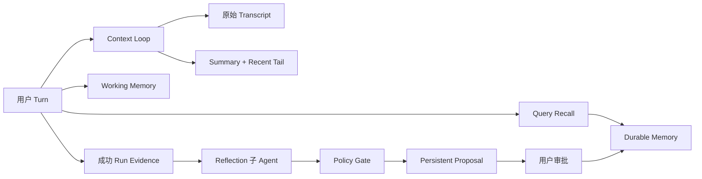

# Sage V6.6-V6.8 上下文、记忆与 Dream 设计

> 本页是可审核的来源投影。后续 LLM 综合必须继续保留来源 revision。

## 来源内容

---
title: 21 - Sage V6.6-V6.8 上下文、记忆与 Dream 设计
type: design-learning
project: Sage
source_branch: dev/sage-v6
source_commit: 2df978a
verified_at: 2026-07-11
tags: [Sage, V6.6, Context, Memory, Dream, Architecture]
---

# Sage V6.6-V6.8 上下文、记忆与 Dream 设计

> [!abstract] 已确认决策
> 采用方案 B：Claude Mini 的分层减重 + Hermes 的生命周期边界 + OpenClaw 的 proposal-first 治理。Context、Memory、Dream 是三个独立循环，不把一个摘要器当成万能记忆系统。

完整执行口径在项目设计书：

`docs/superpowers/specs/2026-07-11-sage-v6-context-memory-evolution-design.md`

## 三个循环



### Context Loop

回答“怎样在模型窗口内继续完成当前任务”。它保存目标、已完成工作、todo、文件、测试、错误和下一步，但摘要不是长期事实。

### Memory Loop

回答“跨会话仍值得记住什么”。Working Memory 可重建；Durable Memory 必须有来源、作用域、版本和审阅状态。

### Dream Loop

回答“哪些证据可能值得升级为长期记忆”。Reflection 子 Agent 只能提出候选，Policy Gate 决定候选是否合格，用户决定是否生效。

## Context 门限

所有比例都基于：

```text
effective_limit = model_context_window - output_reserve
```

| 比例 | 行为 |
| ---: | --- |
| 50% | 历史工具预览进入 30000 字符预算 |
| 60% | 清理重复旧 read/search，保留最近 3 个工具结果 |
| 65% | 只在新 user turn 边界自动 compact |
| 70% | 单轮高压，历史工具预览收紧到 15000 字符 |
| 75% | 可以牺牲热缓存执行更激进减重 |
| 85% | 不再发起不安全模型调用；保存状态，等下一 turn compact |

结果超过 16 KiB 时先完整落盘，再把最多 200 行/12000 字符预览放入活动上下文。语义压缩至少保留最近 3 个完整 turn，最多 12 个；尾部预算是正常 compact 门限的 20%。

摘要失败不应用，原始上下文不变。连续两次节省不足 10%时打开熔断，暂停自动重复压缩。

## Memory 预算

| 内容 | 预算 |
| --- | ---: |
| Working Memory | 2000 字符 |
| 单条 Recall Fact | 800 字符 |
| 每轮 Recall | 最多 5 条/4000 字符 |
| Session 启动索引快照 | 2500 字符 |
| 磁盘 MEMORY.md | 200 行/25 KiB |
| Reflection 输入 | 12000 字符 |

V6.7 先做确定性中英文检索，不引入向量数据库。排序看精确短语、英文词/CJK bigram 重合、topic、provenance 和 freshness。文件 hash 变化后，旧 file note 不再召回。

用户记忆和工作区记忆分开：

```text
user scope      -> 语言、表达偏好、明确个人偏好
workspace scope -> 构建命令、项目约定、架构决策
```

Git 工作区 ID 使用 scope + normalized remote + root commit，避免移动目录或 worktree 导致失忆。V7 再把真实 tenant/user identity 加入 scope。

## Dream 门限

- 手动 `/dream` 在 V6.8 开放。
- 自动 Reflection 默认关闭。
- 开启后需满足 3 个成功 run 或 6 条新合格 evidence。
- 同一 workspace 冷却 30 分钟。
- 同时最多一个 Reflection job 和一个 unresolved proposal。
- 普通推断事实至少来自 2 个独立 run ID。
- Approved plan 或明确 user correction 可用单一来源进入候选。
- Policy score 低于 0.70 直接丢弃。
- 单次最多 5 个候选。
- V6 无论分数多高都不自动批准。

Reflection Agent 无 Shell、文件、网络、MCP、Skill、Remember、Dream 或继续派生 Agent 的权限。它只收到后端构造的 evidence bundle，并返回 JSON candidate。

## Proposal 为什么要版本化

当前 Sage 的 approve API 会批准“内存里最新的 proposal”，重启后 proposal 还会丢失。新设计要求：

```text
proposal_id
base_memory_revision
proposal_version
change_id
evidence_refs
confidence
flags
```

Approve 生成原子 transaction 和 inverse changes。重复网络请求必须幂等；过期 revision 返回冲突；Rollback 只能沿最新 revision chain 撤回。

## 版本边界

| 增量 | 主要目标 |
| --- | --- |
| V6.6 | Token budget、Transcript、工具 Artifact、分层减重、安全 Compact、Context UI |
| V6.7 | Workspace Identity、Revisioned Memory、当前轮 Working Memory、相关 Recall |
| V6.8 | Reflection 子 Agent、持久 Proposal、审批/回滚、Memory Review UI |
| V7 | 登录、租户、GitHub Import、云 Workspace、Sandbox、Quota、Terminal、CI/CD |
| V8 | Local Companion、Code RAG、AST Graph、增量索引和公开上线强化 |

Memory 不承担 Code RAG，Dream 也不更新 AST Graph。Durable Memory 保存“为什么和约束”，RAG/Graph 保存“代码现在是什么”。

## 学习时重点追踪的源码

```text
core/coding/context/
core/coding/persistence/transcript_store.py
core/coding/persistence/tool_result_store.py
core/coding/memory/
core/coding/runtime.py
core/coding/engine/events.py
api/coding.py
frontend/src/stores/codingContext.ts
frontend/src/stores/codingMemory.ts
```

延伸：[[18-上下文压缩对标研究]] · [[19-长短记忆与Dream对标研究]] · [[22-Sol子Agent开发顺序与验收]]
