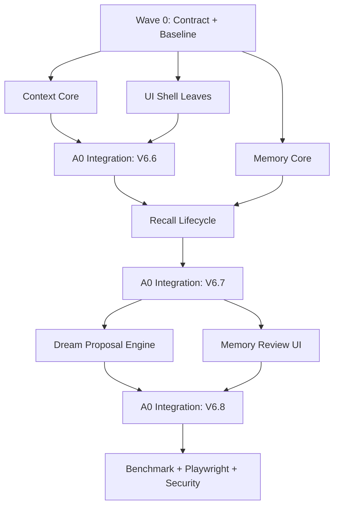

# Sol 子 Agent 开发顺序与验收

> 本页是可审核的来源投影。后续 LLM 综合必须继续保留来源 revision。

## 来源内容

---
title: 22 - Sol 子 Agent 开发顺序与验收
type: implementation-learning
project: Sage
source_branch: dev/sage-v6
verified_at: 2026-07-11
tags: [Sage, Sol, Subagent, GLM, DevelopmentWorkflow]
---

# Sol 子 Agent 开发顺序与验收

> [!abstract] 核心原则
> 并行开发不是让多个 Agent 同时修改 `runtime.py` 和 `CodingView.vue`。正确做法是：一个 Integration Agent 独占组合根，三个叶子 Agent 只创建边界清晰的新模块与测试，按波次合并。

完整执行编排：

`docs/superpowers/plans/2026-07-11-sage-v6-agent-orchestration.md`

## 两种子 Agent 不要混淆

| 类型 | 作用 | 权限 |
| --- | --- | --- |
| Sol/Codex 开发 Agent | 在开发阶段并行写 Sage | 独立 worktree + 文件 ownership |
| Sage Dream Reflection Agent | 产品运行时分析 evidence | 无工具、不可写，只提交 proposal |

开发 Agent 的协作能力不等于 Sage 产品已经具备成熟的多 Agent runtime。

## Agent 所有权

```text
A0 Integration Agent
  -> Runtime / Engine / Events / API
  -> CodingView / root store / event reducer / shared types
  -> 合并、契约审查、全量验证

A1 Context Agent
  -> context budget / projection / compactor
  -> transcript / tool result artifact
  -> context focused tests

A2 Memory-Dream Agent
  -> identity / store / working / recall
  -> evidence / policy / reflection / proposals
  -> memory focused tests

A3 Studio UI Agent
  -> 新 leaf components / domain stores / tokens / i18n
  -> component tests

A4 QA Agent（第二波）
  -> benchmark / Playwright / security review
```

## A0 独占文件

并行波次内，只有 Integration Agent 能修改：

```text
core/coding/runtime.py
core/coding/engine/engine.py
core/coding/engine/events.py
api/coding.py
api/schemas.py
frontend/src/views/CodingView.vue
frontend/src/stores/coding.ts
frontend/src/stores/codingEvents.ts
frontend/src/types/api.ts
frontend/src/components/coding/index.ts
frontend/src/main.ts
frontend/package*.json
```

叶子 Agent 如果发现共享契约缺口，只提交说明和建议 patch，不自行抢改组合根。

## 开发波次



### Wave 0

- 记录 dirty worktree，不清理用户改动。
- 跑 backend、frontend test 与 build 基线。
- 冻结 event/API/storage schema。
- 为每个叶子 Agent 创建独立 worktree。

### Wave 1

三路并行：Context 核心、Memory 核心、UI shell/fixture。每路只能在 focused tests 通过后提交审查。

### V6.6 Integration

A0 合并 Context，接 Runtime、Engine、Events、Context API 和前端 token state。验证失败摘要不丢 history。

### V6.7 Integration

A0 合并 Memory store/recall，确保当前 user message 进入 Working Memory，动态 Recall 不进入 transcript。

### Wave 2 / V6.8

Dream engine、Proposal UI、Benchmark/QA 并行。A0 最后接 scheduler、session events、reconnect 和审批 API。

## 每次交接必须提供

```text
branch / commit
修改文件清单
未修改的 exclusive 文件确认
focused test 命令与真实结果
新增 event/API/schema
已知风险
需要 A0 完成的 integration adapter
```

只说“功能做完了”不算交接。

## 评审顺序

1. Contract review：字段、状态、错误码是否和设计一致。
2. Safety review：是否可能丢 transcript、写错 memory、越过 workspace。
3. Test review：失败、重启、并发、重复请求、迟到事件是否覆盖。
4. Integration review：是否破坏 `run_finished`、approval、diff、session replay。
5. UI review：中文、移动端入口、状态可达、无重叠。
6. Benchmark：必须经过真实 `CodingRuntime`。

## 给 GLM 的执行入口

不要一次把五份计划全部交给一个 Agent。按顺序给：

1. `2026-07-11-sage-v6-agent-orchestration.md`
2. 当前 wave 对应的唯一子计划
3. 总设计书中的事件和存储章节
4. 明确的 exclusive file 禁止清单

每完成一个 wave，先让 Codex 做源码复盘，再进入下一 wave。

## 五份实现计划

```text
docs/superpowers/plans/2026-07-11-sage-v6-agent-orchestration.md
docs/superpowers/plans/2026-07-11-sage-v6-context-compaction.md
docs/superpowers/plans/2026-07-11-sage-v6-memory-lifecycle.md
docs/superpowers/plans/2026-07-11-sage-v6-dream-reflection.md
docs/superpowers/plans/2026-07-11-sage-v6-hermes-ui-alignment.md
```

延伸：[[21-Sage-V6.6-V6.8上下文记忆Dream设计]] · [[15-V6源码复盘与技术债]]
