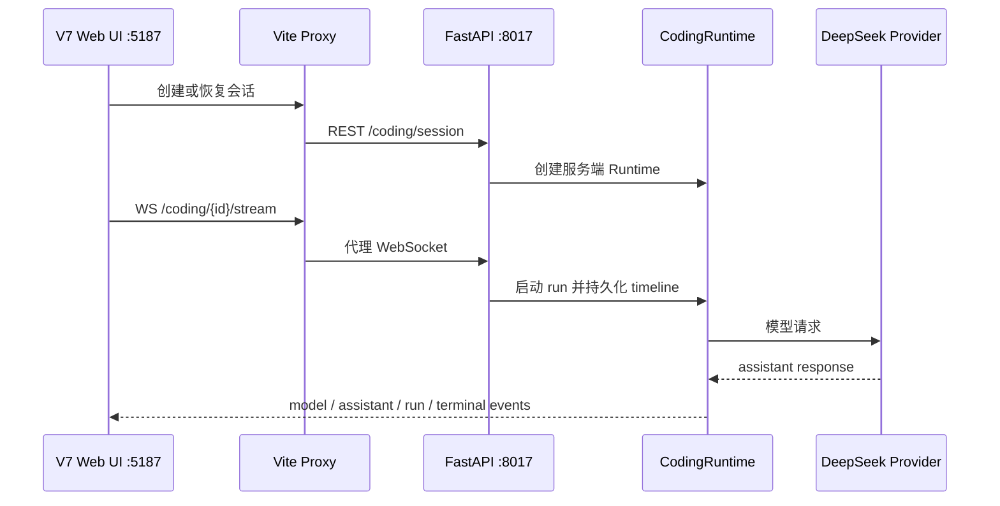

# V7 本地联调与 worktree 启动链路

> 本页是可审核的来源投影。后续 LLM 综合必须继续保留来源 revision。

## 来源内容

# V7 本地联调与 worktree 启动链路

## 阶段结论

- 日期：2026-07-15
- source commit：`33e3951 fix(sage-v7): support worktree local integration`
- 集成分支：`dev/sage-v7`
- 结论：V7 个人助手首页、聊天工作台、真实模型 Provider、WebSocket 时间线与会话恢复已经在本地贯通。

## 问题与根因

V7 运行在独立 Git worktree 中，而模型密钥只保存在主工作区 `.env`。旧版 `scripts/dev.sh` 固定读取当前 worktree 的 `.env`，因此后端虽然可以启动，但创建 Coding Session 时会因为 `DEEPSEEK_API_KEY` 未加载而返回 500。

这不是模型或时间线故障，而是 worktree 与本地密钥文件的装载边界没有显式建模。

## 修复设计

`scripts/dev.sh` 新增两个运行参数：

- `SAGE_ENV_FILE`：显式指定外部环境文件，允许 worktree 复用主工作区密钥，但不复制密钥文件。
- `SAGE_DEV_CHECK_ONLY=1`：只校验环境文件和 Provider 配置，不启动前后端。

启动时只输出已配置的 Provider 名称，不打印 API Key、Base URL 或其他凭据。README 已增加 worktree 联调命令。

```bash
SAGE_ENV_FILE=/Users/zeromadlife/Desktop/tour-agent/.env \
  BACKEND_PORT=8017 FRONTEND_PORT=5187 SAGE_SKIP_DOCKER=1 \
  bash scripts/dev.sh
```

## 联调链路



## 验证证据

- `bash -n scripts/dev.sh`：通过。
- `pytest -q tests/scripts/test_dev_script.py`：`2 passed`。
- `ruff check tests/scripts/test_dev_script.py`：通过。
- `git diff --check`：通过。
- Provider 预检：识别 `DEEPSEEK`、`DOUBAO`、`OPENAI_PROXY`，未输出密钥。
- REST：真实创建 session 成功。
- WebSocket：收到完整 `user -> context -> model -> assistant -> run completed` 事件链。
- timeline：两轮真实对话共 43 个持久事件，两次 terminal 均为 completed。
- 浏览器：首页显示真实最近对话；进入会话后恢复时间线、模型选择和上下文预算。
- 浏览器 Composer：真实回复 `Sage 网页端联调成功`。

## 已关闭风险

- worktree 缺少 `.env` 导致 Coding Session 500。
- 为联调复制密钥到多个 worktree，造成泄露和配置漂移。
- 只验证 API、不验证 Vite Proxy、WebSocket 和页面恢复。
- 页面可打开但 Composer 实际无法调用模型。

## 遗留边界

- 当前是本地单用户开发模式，未加入 V7 云端认证、租户隔离和远程 Workspace Provider。
- 本地服务依赖主工作区 `.env`；正式服务器应改为 CI/CD Secret 或服务器 Secret 注入。
- 本阶段不引入 Docker Compose 生产编排，也不处理 Kubernetes。
- 下一阶段进入 V7-P2：知识源接入、可审核 ingest、Markdown/Wiki 产物、混合检索与引用证据。
