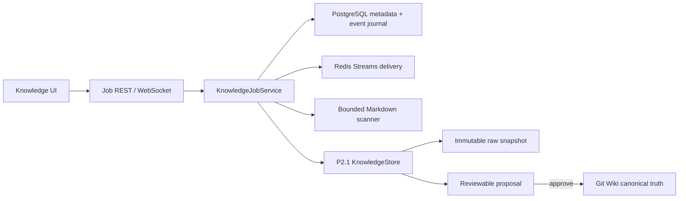

# V7.2 P2.2-A 持久知识任务源码复盘

> 本页是可审核的来源投影。后续 LLM 综合必须继续保留来源 revision。

## 来源内容

# V7.2 P2.2-A 持久知识任务源码复盘

> 日期：2026-07-15
>
> Source commit：`f49c841`
>
> 功能分支：`codex/feat-v7-2-p2-2a-jobs`
>
> 集成目标：`dev/sage-v7`
>
> 收口状态：已快进合入并推送 `origin/dev/sage-v7`；短期 worktree 与功能分支已删除

## 本阶段结论

P2.2-A 已把 P2.1 的“单文件、同步摄取”扩展为可批量、可观察、可恢复的后台任务，但没有改变知识审核真源：Markdown 仍先进入 immutable raw snapshot 和 proposal，只有批准后才能投影到 Git Wiki。

本阶段解决的是任务可靠性，不是 RAG 本身。MinerU、多模态理解、向量数据库、GraphRAG、Louvain 和 HR 公开知识库仍属于后续阶段。

## 架构职责



边界约束：

- PostgreSQL 是 job、item、lease、idempotency 和 event 的唯一状态真源；
- Redis Streams 只负责投递，不承载业务终态；
- 应用先持久化状态和事件，再由 REST/WS 投影给浏览器；
- P2.2-A 使用单 Worker，后续扩展多 Worker 时继续依赖数据库租约与行锁；
- 生产环境仍被 tenant isolation 门槛拒绝，不能把单工作区实现误当成多租户交付。

## 数据模型

新增六类 PostgreSQL 元数据：

| 表 | 职责 |
| --- | --- |
| `knowledge_workspaces` | 知识工作区元数据 |
| `knowledge_source_roots` | 来源标识、类型和显示名，不保存服务器绝对路径 |
| `knowledge_ingest_jobs` | 批任务状态、计数器和单调事件序列 |
| `knowledge_ingest_items` | 文件级 revision、租约、重试和 dead letter |
| `knowledge_ingest_idempotency` | 跨任务的内容 revision 去重声明 |
| `knowledge_job_events` | 先落盘后投影的进度事件日志 |

`python -m db.migrations` 会创建新增表并登记 `20260715_v7_2_knowledge_jobs`。`KNOWLEDGE_JOBS_ENABLED` 默认关闭；迁移或 Redis 不可用时不允许静默降级。

## 状态机与恢复语义

Item 主路径：

```text
queued / retry_wait
  -> claimed
  -> applying
  -> completed | skipped
  -> retry_wait -> dead_letter
  -> cancelled
```

可靠性策略：

- 扫描时记录 `sha256` source revision，真正摄取前再次校验，避免把扫描后的新内容误记为旧任务；
- 幂等键由 workspace、source root、relative path、source revision 和 pipeline version 组成；
- Worker claim 后持有短租约，并按租期三分之一发送 heartbeat；
- 进程重启时回收 Redis pending message、过期数据库租约并补投 PostgreSQL 中可执行条目；
- ACK、stream 删除和发布 marker 删除在 Redis transaction 中完成；
- 失败采用指数退避，超过 `max_attempts` 进入 dead letter，UI 可单条重试；
- 取消是协作式取消：未开始条目立即取消，正在执行的不可逆 P2.1 摄取不会伪造回滚；
- Redis 使用 `noeviction`，避免队列或 marker 被 LRU 淘汰。

## 安全与规模边界

- 浏览器只能提交已配置来源下的 POSIX 相对目录；拒绝绝对路径、`..`、反斜杠和逐级符号链接；
- 递归扫描不跟随 symlink，只读取 Markdown；
- 单任务最多扫描 10,000 个文件，哈希按 1 MiB 分块读取；
- API、事件和错误不返回服务器绝对路径；
- 任务列表每个 job 最多附带 100 个 dead-letter 条目，完整 item 明细通过详情接口按需获取；
- Redis marker 过期或重复投递不会造成重复知识写入，最终由数据库 claim 和 idempotency 阻断。

## API 与 UI

新增接口：

- `POST /api/v1/knowledge/jobs`
- `GET /api/v1/knowledge/jobs`
- `GET /api/v1/knowledge/jobs/{job_id}?include_items=`
- `GET /api/v1/knowledge/jobs/{job_id}/events?after=&limit=`
- `POST /api/v1/knowledge/jobs/{job_id}/cancel`
- `POST /api/v1/knowledge/jobs/{job_id}/items/{item_id}/retry`
- `WS /api/v1/knowledge/jobs/{job_id}/stream?after=`

知识页新增目录批量摄取、持久任务进度、成功/去重/失败/取消计数、取消和 dead-letter 重试。实时进度用 WebSocket，2 秒轮询作为兜底；任务能力关闭时保留 P2.1 单文件审核界面，不伪造可用状态。

## 验证证据

- 后端全量：`1075 passed`；
- 新增任务、队列、扫描器、路由和模型定向测试：`17 passed`；
- 前端全量：`287 passed`（功能提交前完整门禁）；
- 前端定向：`4 passed`；
- `npm run build`：通过，包含 `vue-tsc -b`；
- `ruff check .`：通过；
- `ruff format --check`：本阶段 19 个 Python 路径通过；
- `mypy api core db`：125 files，无错误；
- `git diff --check`：通过；
- 真实 PostgreSQL + Redis smoke：12 个文件全部完成，重复批次 12 个全部命中 skipped，事件序列单调，Redis live policy 为 `noeviction`；
- 覆盖 1000 文件稳定扫描、并发 publish 去重、租约过期、进程重启、ACK 失败恢复、取消竞争、dead letter 和手动重试。

现存但非本阶段引入：Vite 仍提示大型 chunk；全仓库 `mypy .` 仍包含测试和资产脚本历史类型错误。因此本阶段门禁采用项目当前约定的 `mypy api core db`，没有把历史债务描述成已清零。

## 收口判断

结论：**可合并**。

最终集成验证通过，当前结论更新为：**已合并、可开启 P2.2-B**。

已关闭风险：

- 浏览器离开页面导致批任务丢失；
- Redis 重复消息导致重复 proposal；
- 服务重启后 claimed/applying 永久悬挂；
- 目录穿越或 symlink 绕过白名单；
- 一万个失败条目直接撑大任务列表响应；
- P2.2 任务直接绕过 P2.1 审批写入 Git Wiki。

## 下一阶段边界

P2.2-B 再引入 Parser Registry、HTML/PDF、MinerU、Qwen3-VL、对象存储、Source Understanding 和自治 Wiki Policy。P2.3 才实现 PostgreSQL FTS + 向量检索 + RRF + citation benchmark；P2.4 再实现 entity/relation、Louvain 社区与 Knowledge Graph UI。

首次 staging 部署可以在本阶段合入后开始，用真实 Docker Compose、PostgreSQL、Redis、GitHub Actions、备份和重启演练验证任务拓扑。负载均衡与 Kubernetes 仍不作为单机私测前置条件。
